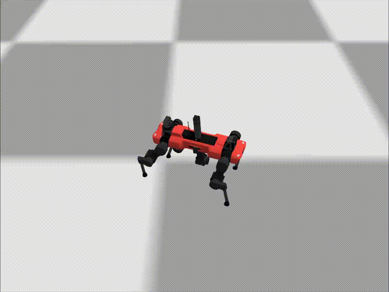
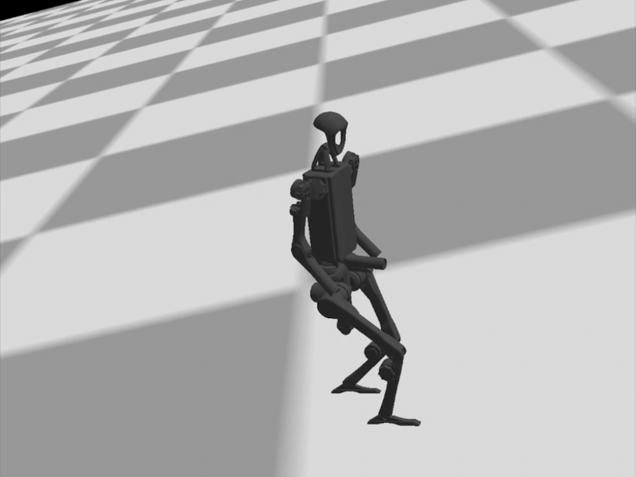

# IsaacSwift

[](LICENSE)


Run Isaac Lab-style legged robot policies directly inside a native Apple runtime.

IsaacSwift rebuilds the pieces a trained robot policy needs at execution time: local articulation physics, on-device policy inference, and Metal 4 rendering. It does not embed Isaac Sim. It takes Isaac Sim / Isaac Lab assets and policies as source material, converts them into app-facing artifacts, then runs the control loop on iPhone and iPad-class hardware.

| Spot | ANYmal-C | H1 |
| --- | --- | --- |
|  |  | 

## Why This Exists

Robotics policies are often trained in heavyweight simulation stacks, then deployed somewhere very different. IsaacSwift is an experiment in making that deployment target small, native, and reproducible:

- **Jolt Physics** provides the local articulation, contact, and actuator-facing feedback loop.
- **Core ML** runs exported Isaac policy models on device.
- **Metal 4** renders the robot assets with a modern Apple GPU baseline.
- **USD-derived metadata** keeps body origins, masses, COM offsets, joint frames, and foot contact topology tied back to the source robot assets.

The result is a native Swift runtime where Isaac-trained legged robots can walk without launching Isaac Sim.

## Current Robot Support

| Robot | Status | Notes |
| --- | --- | --- |
| Spot | Working | Default robot. The flat-terrain policy walks in the Swift + Jolt runtime with USD-derived physics topology. |
| ANYmal-C | Working | The flat-terrain policy and ANYdrive actuator model walk in the Swift + Jolt runtime with USD-derived physics topology. |
| Unitree Go2 | Partial | Asset loading and articulation plumbing exist. A dedicated Go2 policy integration is future work. |
| Unitree H1 | Experimental | H1 Flat Terrain policy conversion, 19-DOF articulation metadata, USDZ packaging, and Jolt-side humanoid physics plumbing are available. |

## Architecture

```text
Isaac Sim USD assets        Isaac Lab policy sources
        |                            |
        v                            v
   USDZ packaging              Core ML conversion
        |                            |
        +------------+---------------+
                     |
                     v
          Native Swift runtime
       Jolt physics + Core ML policy
                     |
                     v
              Metal 4 rendering
```

At runtime, Swift samples observations from the local Jolt articulation, feeds them into the Core ML policy, applies the returned joint actions or actuator inputs, advances physics, and renders the resulting pose with Metal 4.

## Repository Layout

```text
IsaacSwift/              App source, Metal renderer, Jolt bridge, policy loop
IsaacSwiftTests/         Renderer-independent physics and policy tests
IsaacSwiftUITests/       Minimal real-device launch smoke coverage
PolicyModels/            Local generated .mlmodelc bundles, not committed
scripts/                 Build, test, USDZ packaging, and policy conversion tools
skills/                  Project-specific operational notes for agents
docs/                    README media
```

Generated robot assets under `IsaacSwift/RobotAssets/` and compiled policy bundles under `PolicyModels/` are intentionally excluded from git.

## Requirements

- macOS with Xcode and iOS device build support
- Apple Metal Toolchain
- A real iOS device, or an `iphoneos` generic build destination
- NVIDIA Isaac Sim robot asset sources, obtained separately
- Published Isaac policy sources, fetched locally by the repository tooling
- `uv`, used by the policy conversion tooling

This project is **Metal 4 only**. Metal 3 compatibility paths are out of scope, simulator builds are unsupported, and `My Mac (Designed for iPad)` is not a renderer verification target.

## Quick Start

1. Place the Isaac Sim robot asset source pack at the repository root:

   ```text
   isaac-sim-assets-robots_and_sensors-5.1.0/
   ```

2. Generate app-facing USDZ robot assets:

   ```bash
   make usdz
   ```

3. Set up policy conversion tooling and fetch published policy sources:

   ```bash
   make policy-tooling
   make fetch-policies
   ```

4. Convert the supported policy bundles:

   ```bash
   make policy-model
   ```

5. Build for device:

   ```bash
   ./scripts/build-device.sh
   ```

For the standard build plus smoke verification path, run:

```bash
./scripts/agent-ci.sh
```

## Assets And Policies

IsaacSwift does not redistribute NVIDIA robot assets or policy source artifacts.

### Robot Assets

Download Isaac Sim and its assets from NVIDIA, then obtain the `isaac-sim-assets-robots_and_sensors-5.1.0` package. Place the extracted folder at the repository root and run:

```bash
make usdz
```

This generates:

```text
IsaacSwift/RobotAssets/anymal_c/anymal_c.usdz
IsaacSwift/RobotAssets/spot/spot.usdz
IsaacSwift/RobotAssets/go2/go2.usdz
IsaacSwift/RobotAssets/h1/h1.usdz
```

You usually need to regenerate assets only on a new checkout, after changing the packaging scripts, or while debugging USD references, textures, or material conversion.

### Policy Models

Fetch the published Isaac policy sources and convert them into Core ML bundles:

```bash
make policy-tooling
make fetch-policies
make policy-model
```

This generates:

```text
PolicyModels/spot_policy.mlmodelc
PolicyModels/anymal_policy.mlmodelc
PolicyModels/h1_policy.mlmodelc
```

You can build one policy at a time with:

```bash
make spot-policy-model
make anymal-policy-model
make h1-policy-model
```

Go2 currently reuses the Spot policy as a temporary placeholder when selected in the app.

## Build And Test

Use the repository scripts instead of ad hoc simulator builds:

```bash
./scripts/build-device.sh    # iphoneos Debug build, Metal Toolchain checked first
./scripts/test-unit.sh       # Swift unit tests
./scripts/test-smoke.sh      # lightweight smoke path
./scripts/test-ui.sh         # minimal real-device UI launch smoke check
./scripts/agent-ci.sh        # build-device + smoke
```

UI tests are intentionally small. Walking, cadence, policy, and renderer-independent physics coverage belongs in unit and headless tests.

## Developer Notes

- Detailed Metal 4 guidance: [skills/metal4-only/SKILL.md](skills/metal4-only/SKILL.md)
- Asset regeneration workflow: [skills/asset-pipeline/SKILL.md](skills/asset-pipeline/SKILL.md)
- Policy integration workflow: [skills/policy-integration/SKILL.md](skills/policy-integration/SKILL.md)
- NVIDIA policy reference: [Reinforcement Learning Policies Examples in Isaac Sim](https://docs.isaacsim.omniverse.nvidia.com/4.5.0/robot_simulation/ext_isaacsim_robot_policy_example.html)

## License

IsaacSwift is licensed under the Apache License, Version 2.0. See [LICENSE](LICENSE).

### NVIDIA Assets

Robot assets generated for this project are derived from the NVIDIA Isaac Sim asset pack and are subject to the NVIDIA Omniverse License Agreement. Users must obtain those assets directly from NVIDIA.

### Third-party Software

- **Jolt Physics** is licensed under the MIT License. See [IsaacSwift/ThirdParty/Jolt/LICENSE](IsaacSwift/ThirdParty/Jolt/LICENSE).
